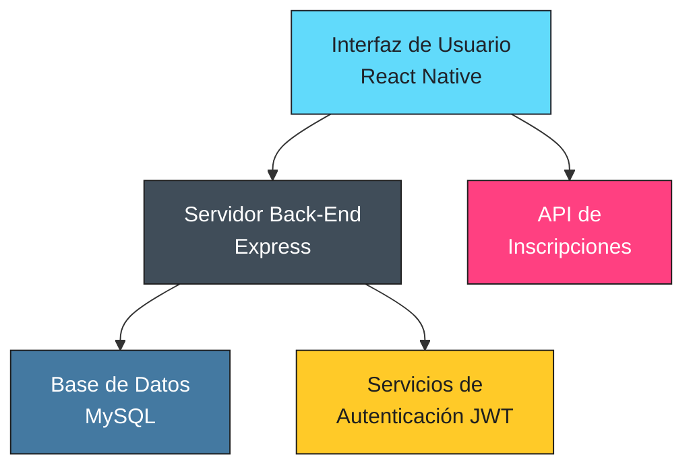

# Aplicación Móvil para A.D. Cierzo ⚽📱

Bienvenido al repositorio de mi **Proyecto de Fin de Ciclo (PFC)**. El objetivo es crear una **aplicación móvil multiplataforma** para **A.D. Cierzo**, una asociación deportiva situada en Zaragoza, que mejore la gestión interna del club y refuerce su presencia digital, atrayendo a nuevos socios y simplificando la comunicación entre sus miembros.

## Índice 👉

1. [Motivación y Objetivos](#motivación-y-objetivos)
2. [Características del Proyecto](#características-del-proyecto)
3. [Tecnologías y Herramientas](#tecnologías-y-herramientas)
4. [Arquitectura del Proyecto](#arquitectura-del-proyecto)
5. [Futuras Funcionalidades](#futuras-funcionalidades)

## Motivación y Objetivos 🚀

* **Modernizar la imagen** del club y centralizar su información.
* **Optimizar la gestión interna** (usuarios, equipos, eventos y actividades).
* **Facilitar inscripciones en línea** y mejorar la comunicación entre administradores, entrenadores, jugadores y visitantes.
* **Incrementar la participación** y visibilidad del club.

## Características del Proyecto ✨

* **Secciones informativas:** Inicio, quiénes somos, deportes (voleibol, baloncesto, fútbol, natación), resultados y clasificaciones, galería multimedia y noticias.
* **Gestión de usuarios y roles:** Administrador, entrenador, jugador y visitante.
* **Inscripciones en línea:** Usuarios pueden registrarse en eventos y equipos, así como darse de baja.
* **Notificaciones push:** Mantiene a los miembros informados de eventos y resultados en tiempo real.
* **Integraciones externas:** Enlaces directos a Instagram y WhatsApp del club.

## Tecnologías y Herramientas 🔧

| Capa              | Tecnologías                                      | Versión/Notas                   |
| ----------------- | ------------------------------------------------ | ------------------------------- |
| **Front‑End**     | Expo, React Native, TypeScript                   | Expo 46.x · React Native 0.70.x |
| **Back‑End**      | Node.js 18.x, Express 4.18.2                     | REST API                        |
| **Base de Datos** | MySQL 8 · Sequelize 6.31                         | ORM mySQL2 3.12                 |
| **Dev & Ops**     | Visual Studio Code, Git + GitHub, Ngrok, Postman |                                 |
| **Diseño**        | Figma (mockups), PlantUML (diagramas)            |                                 |

## Arquitectura del Proyecto 🏛️

### Descripción de la Arquitectura

* **Interfaz de Usuario:** Construida en Expo + React Native con TypeScript para una experiencia móvil fluida.
* **Servidor Back‑End:** API REST en Node.js/Express que implementa la lógica de negocio y la autenticación con JWT.
* **Base de Datos:** MySQL 8 gestionada con Sequelize para almacenar usuarios, deportes, eventos e inscripciones.
* **API de Inscripciones:** Punto de entrada seguro para altas, bajas y consultas de inscripciones.

## Futuras Funcionalidades 💡

* Resultados y calendarios actualizados en tiempo real.
* Soporte multilingüe (ES/EN/FR).
* Implementación de HTTPS y medidas anti‑XSS, CSRF y SQL Injection.
* Gestión de contenido avanzada para administradores.
* Tienda online y pasarela de pago (fase posterior).

> *Proyecto desarrollado por ****Javier Navarro Bovio**** para el ciclo 2º DAM DUAL (CPIFP Los Enlaces).*
