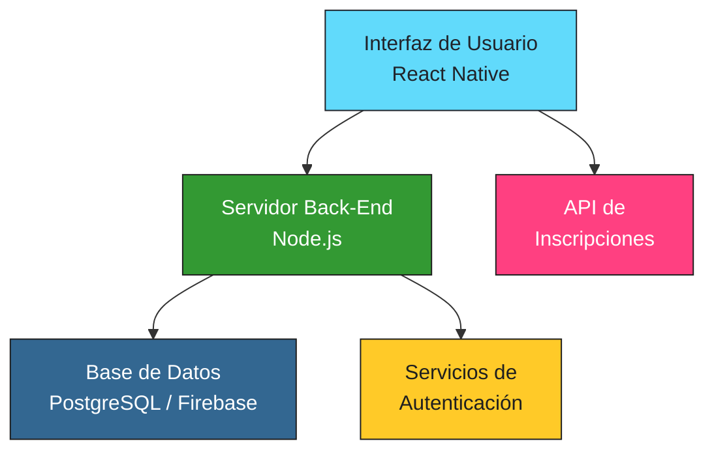

# Aplicación Móvil para Asociación Deportiva ⚽

Bienvenidos al repositorio de nuestro proyecto final de grado. En este proyecto, hemos desarrollado una **Aplicación Móvil para una Asociación Deportiva** con el fin de modernizar su imagen digital, ampliar su alcance online y fomentar una comunicación efectiva entre sus miembros.

---

## Índice 👉

1. [Motivación y Objetivos](#motivación-y-objetivos)
2. [Características del Proyecto](#características-del-proyecto)
3. [Tecnologías y Herramientas](#tecnologías-y-herramientas)
4. [Arquitectura del Proyecto](#arquitectura-del-proyecto)
5. [Futuras Funcionalidades](#futuras-funcionalidades)

---

## Motivación y Objetivos 🚀

En este proyecto, hemos trabajado para **mejorar la presencia digital** de una asociación deportiva. Nuestros objetivos principales son:

- **Modernizar la imagen** de la asociación.
- **Aumentar la interacción** y comunicación interna.
- **Facilitar la inscripción** a eventos y actividades deportivas.
- **Ofrecer una experiencia de usuario** intuitiva y atractiva.

Esta iniciativa busca fortalecer la identidad de la marca y conectar a los miembros a través de una plataforma digital dinámica y accesible.

---

## Características del Proyecto ✨

- **Páginas Informativas:** Página principal, quiénes somos, deportes, eventos, galería multimedia y publicaciones.
- **Gestión de Usuarios:** Registro, inicio y cierre de sesión, y opción para eliminar cuenta.
- **Funcionalidades de Inscripción:** Permite a los usuarios inscribirse en deportes y eventos, gestionar y cancelar inscripciones.
- **Integración Full-Stack:** Desarrollo coordinado del front-end y back-end con conexión a una base de datos robusta.

---

## Tecnologías y Herramientas 🔧

Utilizamos las siguientes tecnologías:

- **Front-End:**
  - [React Native](https://reactnative.dev/) con Expo
  - HTML, CSS y JavaScript/TypeScript
- **Back-End:**
  - [Node.js](https://nodejs.org/)
- **Base de Datos:**
  - [PostgreSQL](https://www.postgresql.org/) o [Firebase](https://firebase.google.com/)

Algunos de nuestros badges representativos:

  
  

---

## Arquitectura del Proyecto 🏛️

A continuación, presentamos un diagrama que ilustra la arquitectura general de nuestra aplicación:

**Descripción del Diagrama:**

- **Interfaz de Usuario:** Desarrollada en React Native, ofrece una experiencia móvil moderna y atractiva.
- **Servidor Back-End:** Implementado en Node.js, se encarga de la lógica de negocio, autenticación y operaciones CRUD.
- **Base de Datos:** Utilizamos PostgreSQL o Firebase para almacenar datos de usuarios, deportes, eventos e inscripciones.
- **API de Inscripciones:** Facilita la interacción de los usuarios con la plataforma de forma fluida.

---

## Futuras Funcionalidades 💡

Entre las mejoras que planeamos implementar se encuentran:

- Información en tiempo real sobre resultados, calendarios y eventos.
- Soporte multilingüe (español, inglés y francés).
- Mayor seguridad mediante HTTPS y medidas contra XSS, CSRF y SQL injection.
- Gestión de roles (administrador, entrenador, jugador y visitante).
- Funcionalidad de gestión de contenido para administradores.
- Integración de tienda online y pasarelas de pago según la evolución del proyecto.
